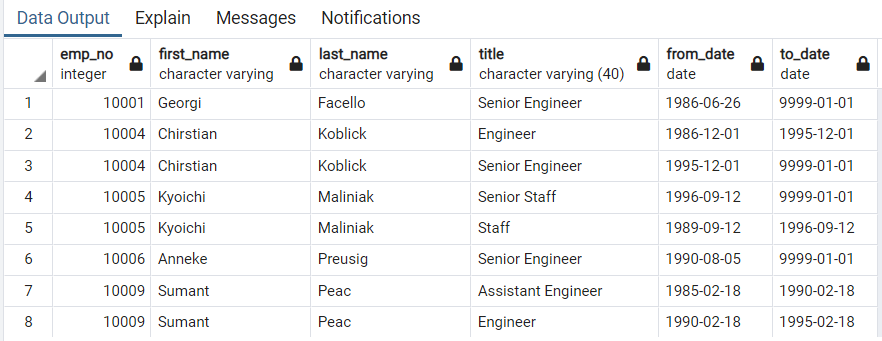
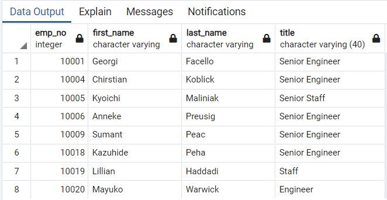
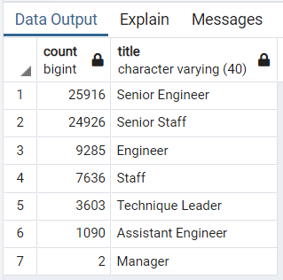

# Pewlett-Hackard-Analysis

### Overview of the analysis

There will be many employees retiring in a couple of years.  The Pewlett-Hackard leadership is trying to understand and coping with the impact of the upcoming "silver tsunami".  Our job is to analyze the data to answer the questions of "How many positions will be affected",  "How many employees will be retiring" and "How many employees are elegibel to mentor program" by using pgAdmin and postgresSQL database.

### Results

##### The Number of Retiring Employees by Title

- ##### Retirement titles

​		This Query and the generated table is to find the employees born between 1952 and 1955 with titles, as shown below:

- ##### Unique titles

​		This Query and the generated table is to find the latest unique titles of the current employees, as shown below:

- ##### Retiring Titles

​		This Query and the generated table is to find number of retiring employees with each titles, as shown below:

##### The Employees Eligible for the Mentorship

​		To mitigate the impact of the blast retirement, the company is to initiate a mentor program.  

- ##### Mentorship Eligibility

​		The Query and the generated table is to identify the current employees born in 1995 who will be eligible for the mentorship program, as shown below:

### Summary

 In the few couple of years, there will be more than 70,000 employees to be retired who were born between 1952 and 1955.  The total employees born in 1965 eligible in the mentorship program is 1549.

- ##### How many roles will need to be filled as the "silver tsunami" begins to make an impact?

  The total roles that will need to be filled is 72458, unevenly distributed among 7 titles, as shown below.

- ##### Are there enough qualified, retirement-ready employees in the departments to mentor the next generation of Pewlett Hackard employees?

  The number of the employees who are eligible to mentorship program is 1549, distributed among each titles, as shown bellow.  In a summary, there are enough qualified, retirement-ready employees in the departments to mentor the next generation of Pewlett Hackard employees.

